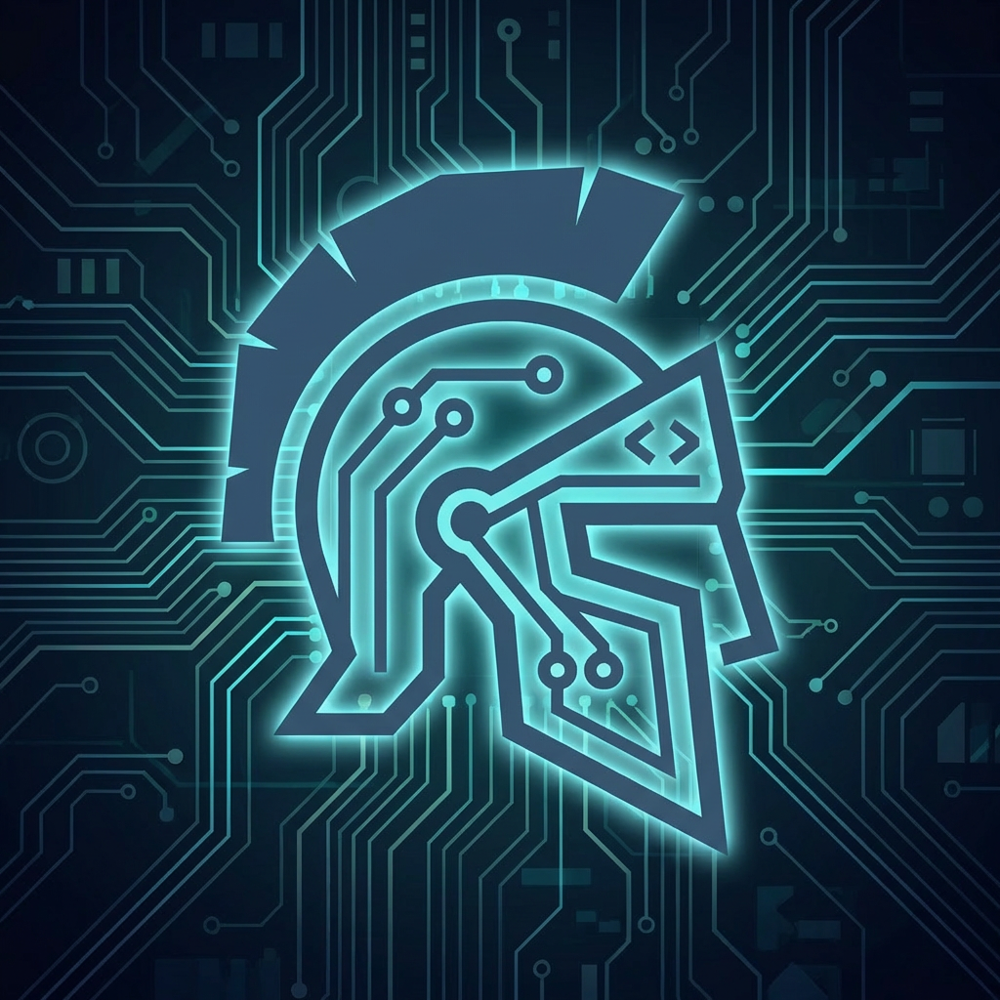

<p align="center">
  
</p>

<p align="center">
  <a href="https://github.com/jpvelasco/ludus/actions/workflows/ci.yml"></a>
  <a href="https://github.com/jpvelasco/ludus/releases/latest"></a>
  <a href="https://github.com/jpvelasco/ludus/blob/main/LICENSE"></a>
  <a href="https://github.com/jpvelasco/ludus/blob/main/go.mod"></a>
</p>

# Ludus

*Latin: "game, play, sport; a training school"*

In ancient Rome, a *ludus* was where gladiators trained — not the arena where they fought, but the school where they learned their craft. The *Ludus Magnus*, built next to the Colosseum, was the largest of these: a place of rigorous preparation where raw recruits were shaped into professionals before they ever set foot on the sand.

That's what this project does. Ludus is the training ground — it takes your game from source code to a battle-ready server, handling all the grueling preparation (engine compilation, cross-platform builds, containerization, deployment) so that when your game enters the arena, it's ready.

---

A CLI tool that automates the end-to-end pipeline for deploying Unreal Engine 5 dedicated servers to AWS GameLift.

Ludus handles the entire workflow that would otherwise require dozens of manual steps across multiple tools: UE5 source builds, game server compilation, Docker containerization, ECR push, and GameLift fleet deployment. For local development, GameLift Anywhere mode skips containers entirely — fleet creation takes seconds instead of minutes. While Lyra (Epic's sample game) is the default project, Ludus supports any UE5 game with dedicated server targets.

## What it does

```
ludus run --verbose
```

This single command orchestrates six stages:

1. **Prerequisite validation** — OS, engine source, game content, Docker, AWS CLI, disk space, RAM
2. **Engine build** — UE5 source compilation (Setup.sh, project files, make)
3. **Game server build** — Dedicated server packaging via RunUAT BuildCookRun
4. **Container build** — Dockerfile generation and Docker image build
5. **ECR push** — Docker image push to Amazon ECR
6. **GameLift deploy** — Container fleet creation with IAM roles and polling

## Prerequisites

### System requirements

- **OS**: Windows 10/11 or Linux x86_64 (Ubuntu recommended)
- **RAM**: 16 GB minimum (UE5 linking uses ~8 GB per job)
- **Disk**: 100 GB free (after engine source is on disk)
- **Go**: 1.24+

### External tools

- **Docker** — for container image builds
- **AWS CLI v2** — configured with credentials (`aws configure sso` or standard config)
- **Git** — for engine source management

### Unreal Engine 5 (source build)

UE5 must be built from source — Epic Launcher builds cannot produce dedicated server targets.

1. Get access to the [UE5 source on GitHub](https://www.unrealengine.com/en-US/ue-on-github) (requires Epic Games account linked to GitHub)
2. Clone the engine source:
   ```bash
   git clone https://github.com/EpicGames/UnrealEngine.git -b 5.6.1-release UnrealEngine-5.6.1-release
   ```

### Lyra Content (manual download required)

Epic does not include Lyra game assets in the GitHub source. The `Content/` folder must be downloaded separately from the Epic Games Launcher Marketplace.

1. Install the [Epic Games Launcher](https://www.unrealengine.com/en-US/download) on Windows or macOS (not available on Linux)
2. Install UE 5.6 through the launcher (version must match your source build)
3. Add [Lyra Starter Game](https://www.fab.com/listings/93faede1-4434-47c0-85f1-bf27c0820ad0) from Fab to your library
4. Create a project from it — this downloads the content assets
5. Copy the `Content/` folder to your engine source tree:
   ```
   <engine>/Samples/Games/Lyra/Content/
   ```
6. Also copy any plugin `Content/` folders if present

> **Note**: This is the most friction-heavy step. The Epic Games Launcher does not run on Linux, so Linux developers need access to a Windows or macOS machine for this one-time download.

### AWS setup

- An AWS account with permissions for GameLift, ECR, IAM, and STS
- Configure authentication: `aws configure sso` or set `AWS_PROFILE`
- An ECR repository (Ludus will push container images here)

## Installation

```bash
git clone git@github.com:jpvelasco/ludus.git
cd ludus
go build -o ludus -v
```

## Configuration

```bash
cp ludus.example.yaml ludus.yaml
```

Edit `ludus.yaml` with your environment settings. Key fields:

| Setting | Description | Default |
|---------|-------------|---------|
| `engine.sourcePath` | Path to UE5 source directory | (required) |
| `engine.maxJobs` | Max parallel compile jobs (0 = auto-detect from RAM) | `0` |
| `engine.backend` | Build backend: `native` or `docker` | `native` |
| `engine.dockerImage` | Pre-built engine Docker image URI (skips engine build) | (empty) |
| `engine.dockerImageName` | Local Docker image name for engine builds | `ludus-engine` |
| `engine.dockerBaseImage` | Base Docker image for engine builds | `ubuntu:22.04` |
| `game.projectName` | UE5 project name | `Lyra` |
| `game.serverMap` | Default server map | `L_Expanse` |
| `container.serverPort` | Game server UDP port | `7777` |
| `game.arch` | Target architecture: `amd64` or `arm64` (Graviton) | `amd64` |
| `deploy.target` | Deployment target: `gamelift`, `stack`, `ec2`, `binary`, `anywhere` | `gamelift` |
| `gamelift.instanceType` | EC2 instance type for fleet | `c6i.large` |
| `anywhere.locationName` | Custom location name for Anywhere fleet | `custom-ludus-dev` |
| `aws.region` | AWS region | `us-east-1` |
| `aws.accountId` | AWS account ID (for ECR URI) | (required for container targets) |

## Usage

### Full pipeline

```bash
# Run all 6 stages
./ludus run --verbose

# Skip engine build (use existing)
./ludus run --verbose --skip-engine

# Skip game build (use existing packaged server)
./ludus run --verbose --skip-engine --skip-game

# Dry run — print commands without executing
./ludus run --dry-run
```

### Individual commands

```bash
# Interactive first-run setup wizard
./ludus setup

# Validate prerequisites (--fix to auto-remediate)
./ludus init --verbose

# Deep diagnostics (toolchain, disk, Docker, AWS, security lint)
./ludus doctor

# Build engine only
./ludus engine build --verbose

# Build game server only (--arch arm64 for Graviton)
./ludus game build --verbose

# Build and push container
./ludus container build --verbose
./ludus container push --verbose

# Deploy to GameLift (imperative API calls)
./ludus deploy fleet --verbose

# Deploy via CloudFormation (atomic with rollback)
./ludus deploy stack --verbose

# Deploy via Managed EC2 (no Docker required)
./ludus deploy ec2 --verbose

# Deploy locally via GameLift Anywhere (seconds, not minutes)
./ludus deploy anywhere --verbose

# Create a game session and connect
./ludus deploy session
./ludus connect

# Tear down all Ludus-managed AWS resources
./ludus deploy destroy --verbose

# Generate BuildGraph XML for Horde/UET
./ludus buildgraph -o build.xml

# Quick config changes
./ludus config set game.arch arm64
./ludus config get engine.sourcePath
```

### Docker build backend

Instead of building the engine natively on the host, Ludus can build UE5 inside a Docker container, producing a reusable image. CI runners then pull the image to run game builds without recompiling the engine.

```bash
# Build engine inside Docker (produces a reusable image)
./ludus engine build --backend docker --verbose

# Push the engine image to ECR
./ludus engine push --verbose

# Build game server using the engine image
./ludus game build --backend docker --verbose

# Full pipeline with Docker backend
./ludus run --backend docker --verbose
```

The `--backend` flag can be set per-command or configured as a default in `ludus.yaml`:

```yaml
engine:
  backend: "docker"
```

**Pre-built engine image**: If the engine image already exists in a registry (built once by a team member or CI), point to it directly and skip the engine build entirely:

```yaml
engine:
  backend: "docker"
  dockerImage: "123456789.dkr.ecr.us-east-1.amazonaws.com/ludus-engine:5.6.1"
```

With `dockerImage` set, `ludus game build --backend docker` and `ludus run --backend docker` will skip the engine build stage and use the specified image for game builds.

**How it works**:
- `ludus engine build --backend docker` generates a Dockerfile (configurable base image, default Ubuntu 22.04), runs `docker build` with the engine source as context, and tags the image as `ludus-engine:<version>`. Use `--base-image` or set `engine.dockerBaseImage` in `ludus.yaml` to use Amazon Linux, RHEL, or other bases (auto-detects `apt-get` vs `dnf`)
- `ludus engine push` authenticates with ECR and pushes the image (creates the ECR repository if needed)
- `ludus game build --backend docker` runs `docker run` with volume mounts for the packaged output, executing RunUAT BuildCookRun inside the engine container
- The rest of the pipeline (container build, ECR push, deploy) works unchanged — the game server output directory is the same regardless of backend

**Notes**:
- Engine Docker images are large (60–100 GB) — this is expected for UE5
- Docker client builds are Linux-only (Win64 cross-compile in Docker is not supported)
- Epic's EULA allows private engine images within an organization; the restriction is on public distribution

### Build caching

Ludus caches build results in `.ludus/cache.json` based on input hashes (git commit, config values, file metadata). If inputs haven't changed since the last successful build, the stage is skipped automatically.

```bash
# Normal run — unchanged stages are skipped via cache
./ludus run --verbose

# Force rebuild of all stages (ignore cache)
./ludus run --no-cache --verbose

# Force rebuild of a single stage
./ludus engine build --no-cache
./ludus game build --no-cache
./ludus container build --no-cache
```

Cache keys per stage:
- **Engine**: git HEAD of engine source, engine version, maxJobs, OS, backend, base image
- **Game server**: engine cache key + .uproject mtime/size, server target, game target, server map
- **Game client**: engine cache key + .uproject mtime/size, client target, platform
- **Container**: server build directory file manifest, project name, server target, server port, image tag

### Global flags

| Flag | Description |
|------|-------------|
| `--verbose` / `-v` | Show detailed output including shell commands |
| `--dry-run` | Print commands without executing |
| `--json` | Output in JSON format |
| `--config <path>` | Config file path (default: `./ludus.yaml`) |
| `--profile <name>` | Use a named profile (isolates config and state) |

## Build time estimates

Measured on an 8-core Ryzen 7 2700X / 64 GB RAM / NVMe SSD (Windows, UE 5.6.1):

| Stage | Time | Notes |
|-------|------|-------|
| Engine build (from source) | ~3.5 hours | Full compile of ShaderCompileWorker + UnrealEditor; `maxJobs` auto-set to 8 |
| Lyra server build | ~45 min | RunUAT BuildCookRun: compile + cook (~3,900 packages) + stage + archive |
| Lyra client build (Win64) | ~45 min | Similar pipeline; incremental compile if engine is already built |
| Container build | ~5 min | Docker image from packaged server (~3 GB image) |
| ECR push | ~5–15 min | Depends on upload bandwidth |
| GameLift fleet deploy | ~10–20 min | Fleet creation + container download + activation polling |

**Full pipeline** (`ludus run`): roughly 5–6 hours on a first run. Subsequent runs with `--skip-engine` take under 2 hours.

These are ballpark figures. Actual times vary with CPU core count, RAM (affects max parallel jobs), disk speed, and network bandwidth. Content cooking is RAM-intensive — 32 GB recommended; on Ubuntu, disable `systemd-oomd` to prevent the OOM killer from terminating the cook process.

## Known issues and workarounds

Ludus automatically handles several UE5 5.6 build issues:

- **NuGet audit errors** — UE 5.6's Gauntlet test framework depends on Magick.NET 14.7.0 which has known CVEs. Combined with Epic's `TreatWarningsAsErrors`, this breaks AutomationTool compilation. Ludus sets `NuGetAuditLevel=critical` as an environment variable on RunUAT child processes (MSBuild reads env vars as properties), avoiding engine source modifications.

- **Multiple server targets** — UE 5.6 Lyra ships with 4 server targets (LyraServer, LyraServerEOS, LyraServerSteam, LyraServerSteamEOS). RunUAT refuses to build without `DefaultServerTarget` configured. Ludus sets this automatically in `DefaultEngine.ini`.

- **Engine make targets** — `LyraServer` is built via RunUAT (stage 3), not via `make` during engine compilation (stage 2). Ludus only builds `ShaderCompileWorker` and `UnrealEditor` in the engine stage.

## Resource management

Ludus tags all AWS resources it creates. Default tags (`ManagedBy: ludus`) are always applied, and custom tags can be configured in `ludus.yaml`:

```yaml
aws:
  tags:
    Project: "my-project"
    Environment: "dev"
```

The `Project` tag is auto-derived from `game.projectName` if not explicitly set.

**Deployment targets:**
- `ludus deploy fleet` — imperative API calls (container group definition → IAM role → fleet)
- `ludus deploy stack` — declarative CloudFormation stack (atomic, with automatic rollback on failure)
- `ludus deploy anywhere` — local development via GameLift Anywhere (see below)

Use `ludus deploy destroy` to tear down all Ludus-managed resources. For `fleet`, resources are deleted in reverse order. For `stack`, the entire CloudFormation stack is deleted atomically. For `anywhere`, the server process is stopped and fleet/location resources are cleaned up.

### GameLift Anywhere (local development)

GameLift Anywhere registers your local machine with GameLift so the game server runs locally while GameLift manages sessions, matchmaking, and player validation. Fleet creation takes seconds instead of 15–30 minutes for container fleets. No Docker build or ECR push required.

```bash
# Build the game server
./ludus game build --verbose

# Create Anywhere fleet + register machine + launch server
./ludus deploy anywhere --verbose

# Create a game session (works with existing session/connect commands)
./ludus deploy session

# Connect a client
./ludus connect

# Iterate: Ctrl+C the server, edit, rebuild, redeploy
./ludus deploy anywhere --verbose

# Clean up
./ludus deploy destroy --target anywhere
```

Use `--ip` to override the auto-detected local IP address. Configure defaults in `ludus.yaml`:

```yaml
anywhere:
  locationName: "custom-ludus-dev"  # Custom location name (must start with "custom-")
  ipAddress: ""                     # Leave empty to auto-detect
  awsProfile: "default"            # AWS profile for wrapper credentials
```

Anywhere is effectively free — AWS provides 3,000 sessions/month in the free tier.

## Deployment support matrix

Ludus supports five deployment targets with two build backends. Not every combination requires Docker, and ARM64 (Graviton) support varies by target.

### By deployment target

| Target | Command | Docker required? | ARM64 support | Best for |
|--------|---------|:---:|:---:|------|
| GameLift Containers | `deploy fleet` | Yes | Yes | Production container fleets |
| CloudFormation Stack | `deploy stack` | Yes | Yes | Production with atomic rollback |
| GameLift Managed EC2 | `deploy ec2` | No | Yes | Production without Docker |
| GameLift Anywhere | `deploy anywhere` | No | No (local only) | Local development/testing |
| Binary export | `deploy binary` | No | Yes | Custom deployment pipelines |

### How builds reach each target

```
                          ┌─────────────────────────────────────────┐
                          │     Native cross-compile (Windows)      │
                          │     game build --arch amd64|arm64       │
                          └─────────────┬───────────────────────────┘
                                        │
              ┌─────────────────────────┼─────────────────────────┐
              │                         │                         │
              ▼                         ▼                         ▼
    ┌─────────────────┐     ┌───────────────────┐     ┌───────────────────┐
    │ container build  │     │   S3 upload (zip)  │     │   File copy       │
    │ --arch amd64|arm64│    │                   │     │                   │
    │ + ECR push       │     └────────┬──────────┘     └────────┬──────────┘
    └────────┬─────────┘              │                         │
             │                        │                         │
    ┌────────┴────────┐      ┌────────┴────────┐      ┌────────┴────────┐
    │ deploy fleet    │      │ deploy ec2      │      │ deploy binary   │
    │ deploy stack    │      │                 │      │ deploy anywhere │
    └─────────────────┘      └─────────────────┘      └─────────────────┘
```

### ARM64 / Graviton workflow

ARM64 targets Graviton instances (20-30% cheaper than x86). The architecture flag flows through the entire pipeline:

```bash
# Build ARM64 server (cross-compiles from Windows)
./ludus game build --arch arm64

# Option A: Container fleet (GameLift Containers)
./ludus container build --arch arm64    # docker build --platform linux/arm64
./ludus container push
./ludus deploy fleet --with-session     # auto-selects c7g.large Graviton instance

# Option B: Managed EC2 (no Docker needed)
./ludus deploy ec2 --arch arm64 --with-session
```

Set `game.arch: arm64` in `ludus.yaml` to default all commands to ARM64 without passing `--arch` each time.

## AI Agent Integration (MCP)

`ludus mcp` starts a [Model Context Protocol](https://modelcontextprotocol.io/) server over stdio, exposing the full pipeline as 21 tools. Any MCP-compatible AI agent — Claude Code, OpenCode, Claude Desktop, Kiro, Cursor, VS Code Copilot — can orchestrate builds, deployments, and game sessions programmatically.

### Prerequisites

- `ludus` binary built and available (on PATH or referenced by absolute path)
- `ludus.yaml` configured in the working directory
- Same external tools as CLI usage (Docker, AWS CLI, Git, Go)

### Client configuration

Add ludus as an MCP server in your agent's config. The JSON format varies by client.

#### OpenCode

Add to `opencode.json` in your project root (or `~/.config/opencode/config.json` globally):

```json
{
  "$schema": "https://opencode.ai/config.json",
  "mcp": {
    "ludus": {
      "type": "local",
      "command": ["ludus", "mcp"],
      "enabled": true
    }
  }
}
```

#### Claude Desktop / Kiro / Cursor

These clients share the same format. Config file locations:

| Client | Config file |
|--------|------------|
| Claude Desktop | `%APPDATA%\Claude\claude_desktop_config.json` (Windows) / `~/Library/Application Support/Claude/claude_desktop_config.json` (macOS) |
| Kiro | `.kiro/settings/mcp.json` (workspace) or `~/.kiro/settings/mcp.json` (global) |
| Cursor | `.cursor/mcp.json` (workspace) or `~/.cursor/mcp.json` (global) |

```json
{
  "mcpServers": {
    "ludus": {
      "command": "ludus",
      "args": ["mcp"]
    }
  }
}
```

#### VS Code (Copilot)

Add to `.vscode/mcp.json` in your workspace:

```json
{
  "servers": {
    "ludus": {
      "command": "ludus",
      "args": ["mcp"]
    }
  }
}
```

### Available tools

| Domain | Tool | Description |
|--------|------|-------------|
| Init | `ludus_init` | Validate prerequisites (OS, engine source, toolchain, content, Docker, AWS, disk, RAM) |
| Status | `ludus_status` | Check status of all pipeline stages |
| Engine | `ludus_engine_setup` | Run Setup.sh to download engine dependencies |
| | `ludus_engine_build` | Build UE5 from source (long-running, blocks) |
| | `ludus_engine_push` | Push engine Docker image to ECR |
| Game | `ludus_game_build` | Build dedicated server via RunUAT (long-running, blocks) |
| | `ludus_game_client` | Build standalone client for Linux or Win64 (long-running, blocks) |
| Container | `ludus_container_build` | Generate Dockerfile and build container image |
| | `ludus_container_push` | Push container image to ECR |
| Deploy | `ludus_deploy_fleet` | Deploy GameLift container fleet (long-running) |
| | `ludus_deploy_stack` | Deploy via CloudFormation (long-running) |
| | `ludus_deploy_anywhere` | Deploy locally via GameLift Anywhere |
| | `ludus_deploy_ec2` | Deploy via GameLift Managed EC2 (no Docker) |
| | `ludus_deploy_session` | Create a game session, returns connection details |
| | `ludus_deploy_destroy` | Tear down all deployed resources |
| Connect | `ludus_connect_info` | Get connection info for current session and client build |
| BuildGraph | `ludus_buildgraph` | Generate BuildGraph XML for Horde/UET |
| Async | `ludus_engine_build_start` | Start engine build (returns immediately with build ID) |
| | `ludus_game_build_start` | Start game server build (returns immediately) |
| | `ludus_game_client_start` | Start client build (returns immediately) |
| | `ludus_build_status` | Poll build status, retrieve output, or cancel |

### Typical workflow

An agent orchestrating the full pipeline would call tools in this order:

```
ludus_init → ludus_engine_build → ludus_game_build → ludus_container_build →
ludus_container_push → ludus_deploy_fleet → ludus_deploy_session → ludus_connect_info
```

Use `ludus_status` to check which stages are already complete — agents can skip stages with cached results. For local development, replace the container/fleet steps with `ludus_deploy_anywhere`.

### Notes

- **Error handling**: Operational errors (build failures, AWS errors) return `CallToolResult` with `isError: true` and a JSON message. Go-level errors are reserved for protocol failures.
- **Async builds**: For long-running operations (engine/game builds), use the `_start` variants which return immediately with a build ID. Poll with `ludus_build_status` to check progress, retrieve output, or cancel. The synchronous tools (`ludus_engine_build`, `ludus_game_build`, `ludus_game_client`) block until complete.
- **Configuration**: All tools read from the same `ludus.yaml` as CLI commands. Every tool accepts `verbose` and `dryRun` parameters.

## Roadmap

- **WSL2 support** — OS prereq check update, `.wslconfig` memory guidance, Linux filesystem for I/O performance
- **macOS support** — Mac-specific engine scripts (Setup.command, Xcode), cross-compilation strategy

## License

[MIT](LICENSE)
